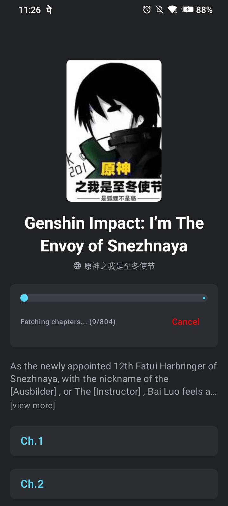
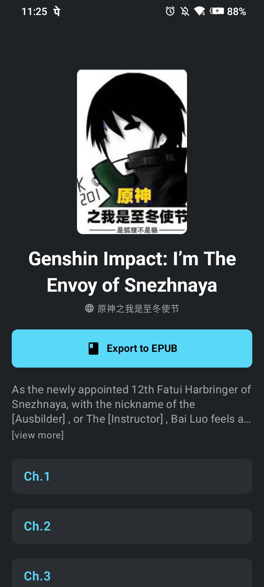
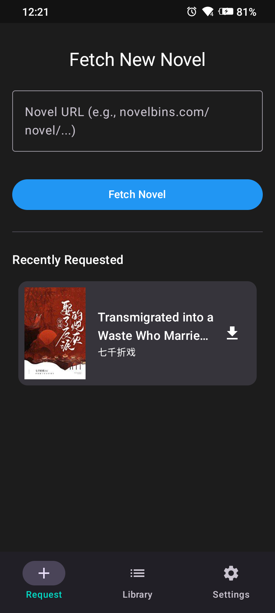

# LNCrawler

**LNCrawler** is a Kotlin-based Android application for crawling and exporting light novels. It combines the powerful scraping logic inspired by [lightnovel-crawler](https://github.com/lncrawl/lightnovel-crawler) with a UI inspired by [Tachiyomi](https://github.com/tachiyomi).

## LNCrawler Overview

  
  
  

## Getting Started

### Prerequisites
- Android Studio Ladybug (or newer)
- JDK 17+
- Android Device or Emulator (API 26+)

### Installation
1. Clone the repository.
2. Open the project in Android Studio.
3. Sync Gradle and run the `app` module.

## Supported Sources
- [NovelBins](https://novelbins.com)
- 📢 more sources will be added soon

## 🤝 Contributing

Contributions are welcome! Please check out our [CONTRIBUTING.md](CONTRIBUTING.md) to learn about the architecture and how to add new crawlers.
