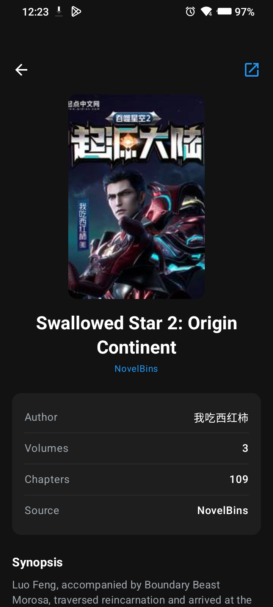
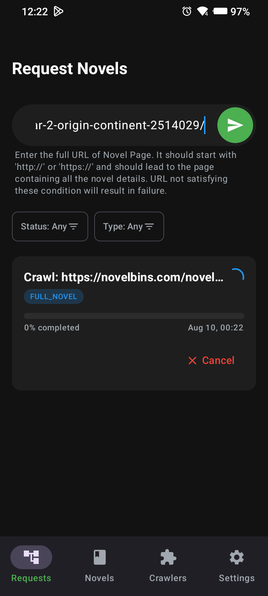
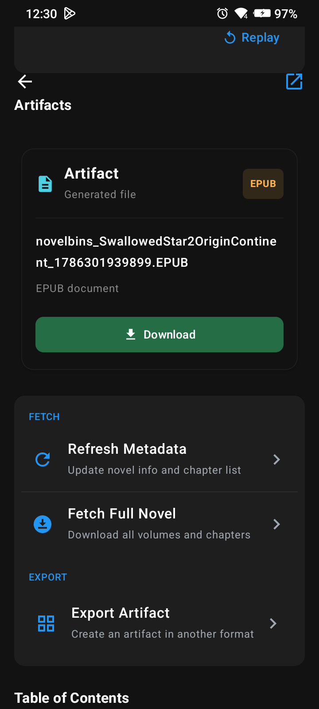
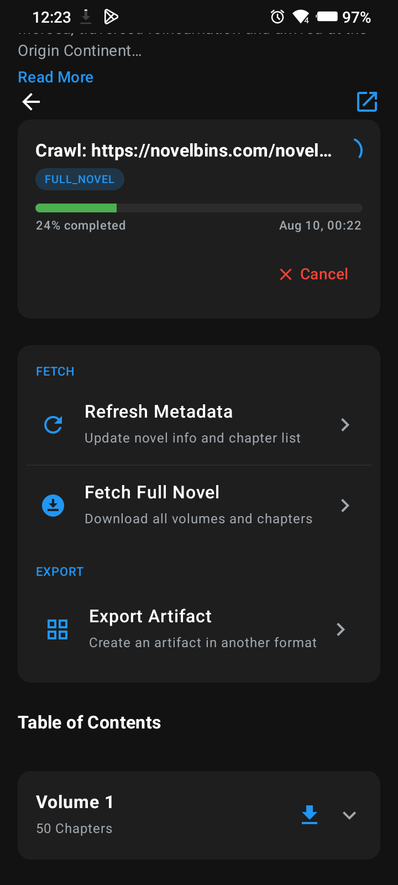
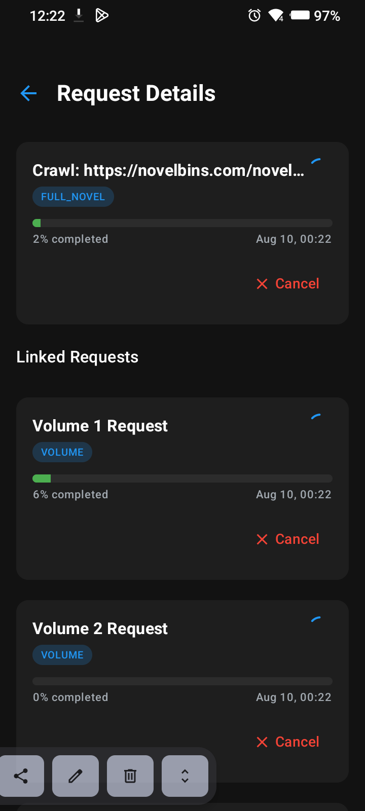

# LNCrawler

**LNCrawler** is an Android application for crawling and exporting light novels. It combines the powerful scraping logic inspired by [lightnovel-crawler](https://github.com/lncrawl/lightnovel-crawler) with a UI inspired by [Tachiyomi](https://github.com/tachiyomi).

## LNCrawler Overview

  
  
  

  
  

## Key Features
- **Job-based Crawling System:** Can handle multiple Crawl Requests at the same time.
- **Tachiyomi-inspired UI:** A clean, modern interface built with Jetpack Compose.
- **Exporting Options:** Package your favorite light novels into EPUB or other formats (more coming soon).
- **Library Management:** Keep track of your downloaded novels.
- **Multi-source Support:** Easily add new sources for expansion.

## Getting Started

### Prerequisites
- Android Studio Ladybug (or newer)
- JDK 17+
- Android Device or Emulator (API 26+)

### Installation
1. Clone the repository.
2. Open the project in Android Studio.
3. Sync Gradle and run the `app` module.

## Supported Sources
- [NovelBins](https://novelbins.com)
- 📢 more sources will be added soon

## 🏗 Architecture
LNCrawler follows a **Clean Architecture** with a **Job-based request system** for reliability. For a deeper dive into how it works and how to contribute, see [CONTRIBUTING.md](CONTRIBUTING.md).

## 🤝 Contributing

Contributions are welcome! Please check out our [CONTRIBUTING.md](CONTRIBUTING.md) to learn about the architecture and how to add new crawlers.
