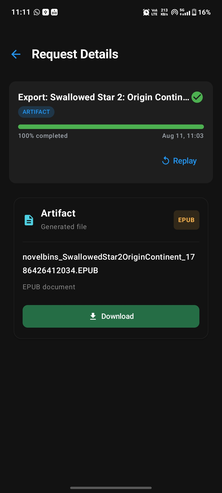
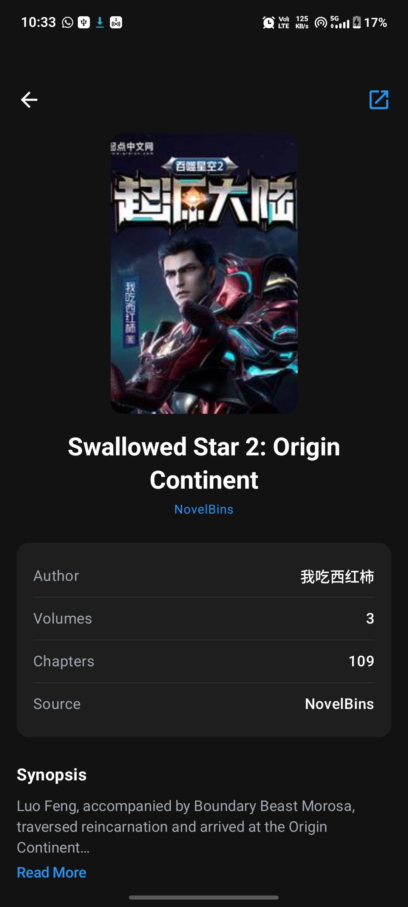
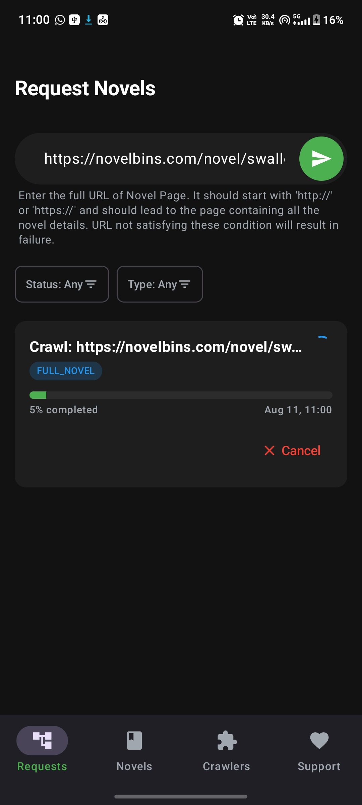
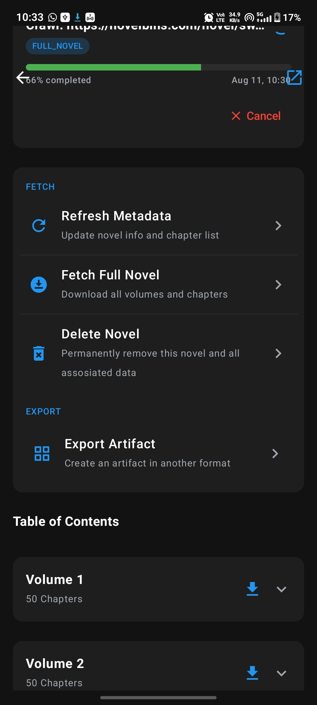
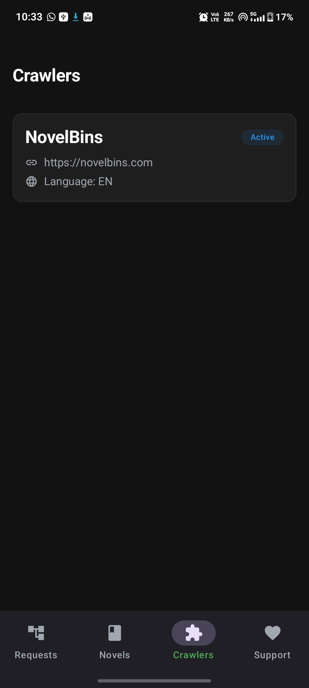
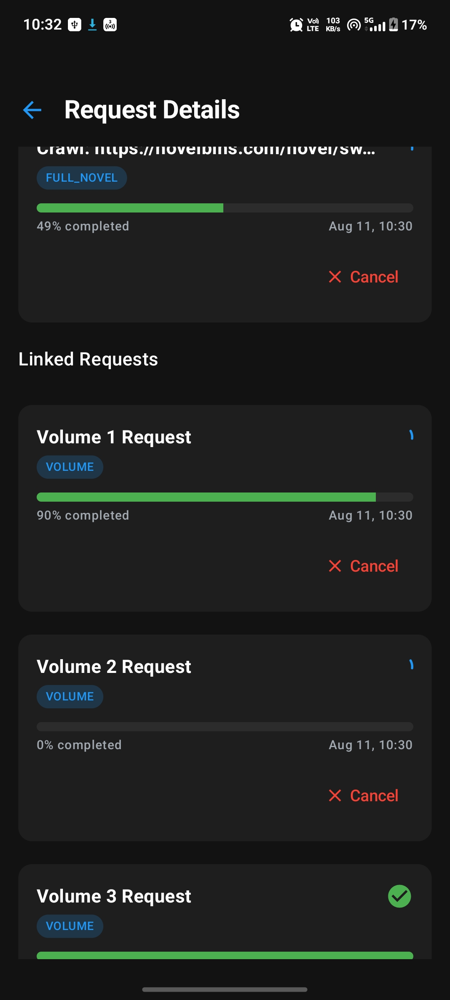

# LNCrawler

### EBook Exporter for Android

 

  <picture>
    <source media="(prefers-color-scheme: dark)" srcset="https://www.shieldcn.dev/github/stars/Binit06/LNCrawler.svg?variant=secondary&size=sm&mode=dark">
    
  </picture>
  &nbsp;
  <picture>
    <source media="(prefers-color-scheme: dark)" srcset="https://www.shieldcn.dev/github/forks/Binit06/LNCrawler.svg?variant=secondary&size=sm&mode=dark">
    
  </picture>
  &nbsp;
  <picture>
    <source media="(prefers-color-scheme: dark)" srcset="https://www.shieldcn.dev/github/contributors/Binit06/LNCrawler.svg?theme=emerald&size=sm&mode=dark">
    
  </picture>

  <picture>
    <source media="(prefers-color-scheme: dark)" srcset="https://www.shieldcn.dev/github/release/Binit06/LNCrawler.svg?size=sm&mode=dark">
    
  </picture>
  &nbsp;
  <picture>
    <source media="(prefers-color-scheme: dark)" srcset="https://www.shieldcn.dev/github/license/Binit06/LNCrawler.svg?variant=ghost&size=sm&mode=dark">
    
  </picture>

 

<h1>Screenshots</h1>

---

<h1>Features</h1>

<table>
  <tr>
    <td width="50%" valign="top">

#### Crawling
- Fetch EBooks from supported sources
- Supports multiple novel sources through independent crawlers
- Update Novel Metadata

</td>
    <td width="50%" valign="top">

#### Dynamic Sources
- Loads crawlers automatically from DEX extensions
- Add new sources without modifying the core crawling engine

</td>
  </tr>
  <tr>
    <td width="50%" valign="top">

#### Performance
- Coroutine Based Scrapping
- Concurrent chapter + content fetching
- Implements Local Processing

</td>
    <td width="50%" valign="top">

#### Architecture
- Isolated crawler implementations
- Pluggable source architecture

</td>
  </tr>
  <tr>
    <td width="50%" valign="top">

#### Developer Experiences
- Easy-to-add new sources
- Clearly separates crawler implementaion and core architechture

</td>
    <td width="50%" valign="top">

#### Android
- Build with Kotlin
- Jetpack Compose UI
- Local file access

</td>
  </tr>
</table>

---

<h1>Download Now</h1>

<table>
  <tr>
    <th align="center">GitHub</th>
  </tr>
  <tr>
    <td align="center">
      
    </td>
  </tr>
</table>

---

<h1>Support the Project</h1>

<h3>LNCrawler is free and open-source. If you find it useful, consider supporting the development!</h3>

#### Buy Me a Coffee

---

<h1>Special Thanks</h1>

<h3>LNCrawler took a lot of inspiration from these incredible open-source work.</h3>

---

<h1>Contributors</h1>

<h3>Thanks to everyone who contributes to LNCrawler!</h3>

---

 

**Made with ❤️ by [Binit06](https://github.com/Binit06)**

